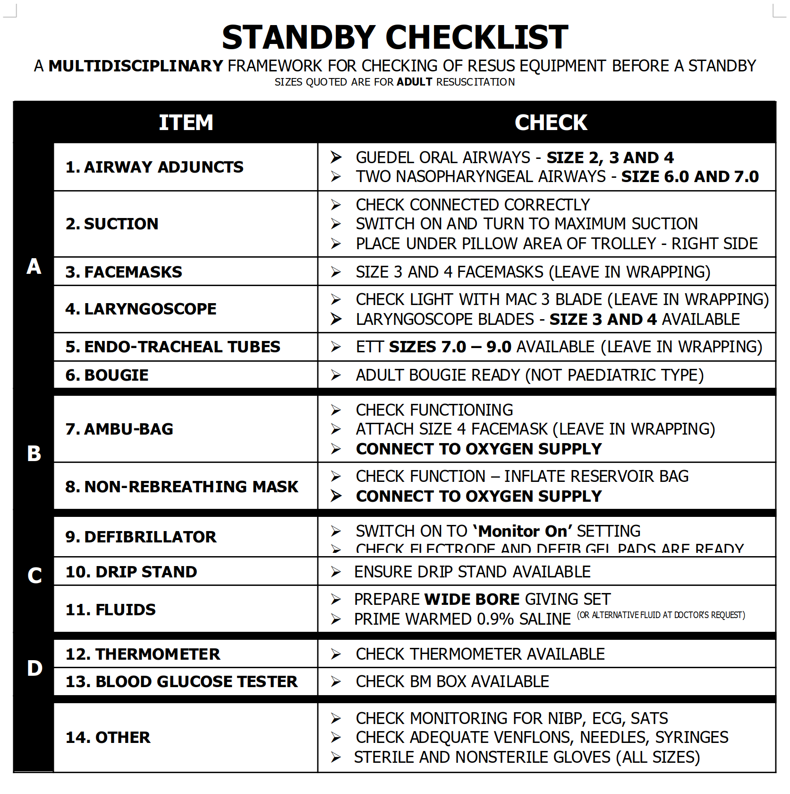

# Resus Standby Checklist

- A checklist I wrote in 2005 to help prepare the Resuscitation room for an incoming 'Pre-alert' or 'Standby' call.

- Some parts of it are probably quite out of date now, but the idea of having a checklist for perparations like this is not out of date, in fact it has gained momentum with programmes like the [WHO Pre-operative checklist](1) and popular books such as Atul Gawande's [The Checklist Manifesto](2)

## Documents

- The original 2005 .doc Word document.
  [Word .doc Standby Checklist](standby_checklist_v3.doc)

- A Markdown version, which formats OK but is a nightmare to edit. Suggestions for ways to create Checklists neatly and elegantly in some form of Markdown or related form are welcomed.
  [Markdown Standby Checklist](standby_checklist.md)

## Preview

## References

1. https://www.who.int/patientsafety/topics/safe-surgery/checklist/en/
1. http://atulgawande.com/book/the-checklist-manifesto/
